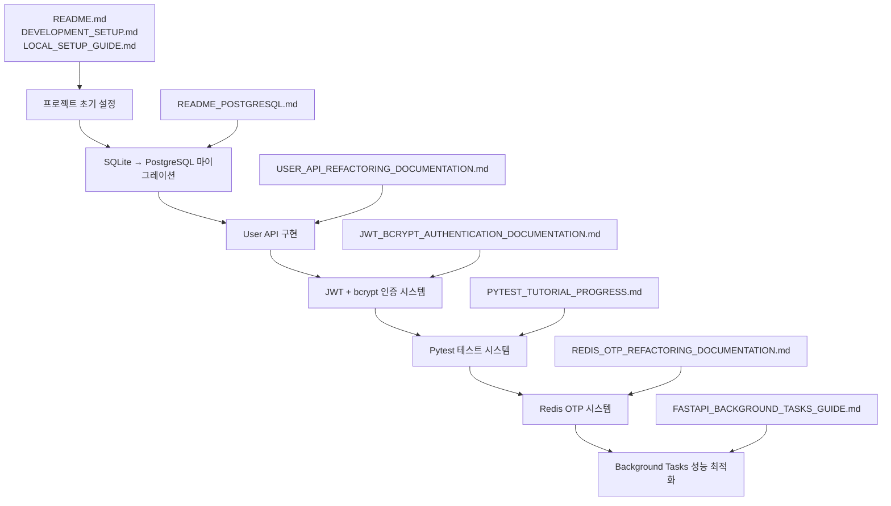

# 📚 프로젝트 문서 가이드 - 리팩토링 순서별 정리

## 🎯 문서 개요

이 가이드는 FastAPI TODO 프로젝트의 리팩토링 과정을 순서대로 정리한 문서들입니다. 각 단계별로 어떤 변경사항이 있었는지, 왜 그렇게 변경했는지 상세히 기록되어 있습니다.

## 📋 문서 목록 (리팩토링 순서)

### 1️⃣ **기본 설정 및 환경 구성**

#### 📖 `README.md` - 프로젝트 메인 문서
- **목적**: 프로젝트 전체 개요 및 기본 사용법
- **내용**:
  - Clean Architecture 구조 설명
  - API 엔드포인트 목록
  - 설치 및 실행 방법
  - 테스트 실행 가이드
- **리팩토링 시점**: 프로젝트 초기 설정

#### 📖 `DEVELOPMENT_SETUP.md` - 개발 환경 설정
- **목적**: 개발자를 위한 상세한 환경 설정 가이드
- **내용**:
  - Python 가상환경 설정
  - 의존성 설치
  - 데이터베이스 설정
- **리팩토링 시점**: 프로젝트 초기 설정

#### 📖 `LOCAL_SETUP_GUIDE.md` - 로컬 개발 가이드
- **목적**: 로컬 개발 환경 구축을 위한 단계별 가이드
- **내용**:
  - 환경변수 설정
  - 데이터베이스 초기화
  - 서버 실행 방법
- **리팩토링 시점**: 프로젝트 초기 설정

#### 📖 `VIRTUAL_ENV_GUIDE.md` - 가상환경 관리 가이드
- **목적**: Python 가상환경 설정 및 관리 방법
- **내용**:
  - 가상환경 생성 및 활성화
  - 패키지 관리
  - VS Code 설정
- **리팩토링 시점**: 개발 환경 문제 해결 시

#### 📖 `setup_global_vscode.md` - VS Code 전역 설정
- **목적**: VS Code 전역 설정 및 Python 인터프리터 설정
- **내용**:
  - Python 인터프리터 선택
  - 확장 프로그램 설치
  - 디버깅 설정
- **리팩토링 시점**: IDE 설정 문제 해결 시

### 2️⃣ **데이터베이스 마이그레이션**

#### 📖 `README_POSTGRESQL.md` - PostgreSQL 설정 가이드
- **목적**: SQLite에서 PostgreSQL로 마이그레이션 과정
- **내용**:
  - PostgreSQL 설치 및 설정
  - Docker를 이용한 PostgreSQL 실행
  - 데이터베이스 연결 설정
  - 마이그레이션 과정 및 문제 해결
- **리팩토링 시점**: SQLite → PostgreSQL 마이그레이션

### 3️⃣ **API 구조 개선**

#### 📖 `USER_API_REFACTORING_DOCUMENTATION.md` - User API 리팩토링
- **목적**: User API 구현 과정 및 구조 개선
- **내용**:
  - User 도메인 모델 설계
  - API 엔드포인트 구현
  - 에러 처리 개선
  - 테스트 코드 작성
- **리팩토링 시점**: User API 추가 구현

### 4️⃣ **인증 시스템 구현**

#### 📖 `JWT_BCRYPT_AUTHENTICATION_DOCUMENTATION.md` - JWT + bcrypt 인증 시스템
- **목적**: JWT 토큰 기반 인증 및 bcrypt 비밀번호 해싱 구현
- **내용**:
  - JWT 토큰 생성 및 검증
  - bcrypt를 이용한 비밀번호 해싱
  - 로그인/회원가입 API 구현
  - 인증 미들웨어 구현
  - 기존 TODO API에 인증 적용
- **리팩토링 시점**: 인증 시스템 추가

### 5️⃣ **테스트 시스템 구축**

#### 📖 `PYTEST_TUTORIAL_PROGRESS.md` - Pytest 튜토리얼 진행 상황
- **목적**: Pytest를 이용한 테스트 시스템 구축 과정
- **내용**:
  - Pytest 기본 설정
  - Fixture 활용
  - Mocking 테스트
  - 통합 테스트 작성
  - 인증 시스템 테스트 업데이트
- **리팩토링 시점**: 테스트 시스템 구축

### 6️⃣ **Redis OTP 시스템 구현**

#### 📖 `REDIS_OTP_REFACTORING_DOCUMENTATION.md` - Redis OTP 인증 시스템
- **목적**: Redis를 활용한 OTP 인증 시스템 구현
- **내용**:
  - Redis 클라이언트 설정
  - OTP 서비스 레이어 구현
  - OTP API 엔드포인트 구현
  - 보안 강화 (일회성 사용, 자동 만료)
  - 통합 테스트 작성
- **리팩토링 시점**: 최신 구현 (Redis OTP 시스템)

#### 📖 `FASTAPI_BACKGROUND_TASKS_GUIDE.md` - Background Tasks 성능 최적화
- **목적**: FastAPI Background Tasks를 통한 성능 최적화 구현
- **내용**:
  - 이메일 서비스 구현 (개발/프로덕션 모드)
  - 백그라운드 작업 함수들 (이메일, 로깅, 알림, 정리, 분석)
  - 성능 향상 결과 (66.7% 응답 시간 개선)
  - 포괄적인 테스트 코드 (39개 테스트)
  - 실제 서버 테스트 스크립트
- **리팩토링 시점**: 최신 구현 (Background Tasks 성능 최적화)

## 🔄 리팩토링 타임라인

## 📊 각 문서의 상세 정보

### 🏗️ **아키텍처 문서**
- **README.md**: 전체 프로젝트 구조 및 사용법
- **DEVELOPMENT_SETUP.md**: 개발 환경 설정
- **LOCAL_SETUP_GUIDE.md**: 로컬 개발 가이드

### 🔧 **환경 설정 문서**
- **VIRTUAL_ENV_GUIDE.md**: 가상환경 관리
- **setup_global_vscode.md**: VS Code 설정

### 🗄️ **데이터베이스 문서**
- **README_POSTGRESQL.md**: PostgreSQL 마이그레이션

### 🚀 **기능 구현 문서**
- **USER_API_REFACTORING_DOCUMENTATION.md**: User API 구현
- **JWT_BCRYPT_AUTHENTICATION_DOCUMENTATION.md**: 인증 시스템
- **REDIS_OTP_REFACTORING_DOCUMENTATION.md**: OTP 시스템
- **FASTAPI_BACKGROUND_TASKS_GUIDE.md**: Background Tasks 성능 최적화

### 🧪 **테스트 문서**
- **PYTEST_TUTORIAL_PROGRESS.md**: 테스트 시스템 구축

## 🎯 문서 활용 방법

### 📖 **새로운 개발자 온보딩**
1. `README.md` - 프로젝트 전체 이해
2. `DEVELOPMENT_SETUP.md` - 개발 환경 설정
3. `LOCAL_SETUP_GUIDE.md` - 로컬 실행 방법
4. `VIRTUAL_ENV_GUIDE.md` - 가상환경 설정

### 🔍 **특정 기능 이해**
- **인증 시스템**: `JWT_BCRYPT_AUTHENTICATION_DOCUMENTATION.md`
- **OTP 시스템**: `REDIS_OTP_REFACTORING_DOCUMENTATION.md`
- **User API**: `USER_API_REFACTORING_DOCUMENTATION.md`
- **Background Tasks**: `FASTAPI_BACKGROUND_TASKS_GUIDE.md`
- **테스트**: `PYTEST_TUTORIAL_PROGRESS.md`

### 🛠️ **문제 해결**
- **환경 문제**: `VIRTUAL_ENV_GUIDE.md`, `setup_global_vscode.md`
- **데이터베이스 문제**: `README_POSTGRESQL.md`
- **API 문제**: 각 기능별 리팩토링 문서

## 📈 문서 업데이트 가이드

### ✏️ **새로운 기능 추가 시**
1. 해당 기능의 리팩토링 문서 작성
2. `README.md` 업데이트 (새로운 엔드포인트 추가)
3. 필요시 설정 가이드 업데이트

### 🔄 **기존 기능 수정 시**
1. 해당 리팩토링 문서에 변경사항 기록
2. 영향받는 다른 문서들 업데이트
3. 테스트 문서 업데이트

### 📝 **문서 작성 규칙**
- **목적 명확화**: 문서의 목적과 대상 독자 명시
- **단계별 설명**: 복잡한 과정은 단계별로 분해
- **코드 예시**: 실제 코드와 함께 설명
- **문제 해결**: 발생할 수 있는 문제와 해결책 포함

## 🎉 결론

이 문서들은 프로젝트의 리팩토링 과정을 체계적으로 기록한 것입니다. 각 문서는 특정 시점의 변경사항과 그 이유를 명확히 설명하고 있어, 프로젝트의 진화 과정을 이해하는 데 도움이 됩니다.

**주요 성과:**
- ✅ **체계적인 문서화**: 각 리팩토링 단계별 상세 기록
- ✅ **재사용 가능한 가이드**: 새로운 개발자 온보딩 지원
- ✅ **문제 해결 지원**: 각종 설정 및 구현 문제 해결 방법
- ✅ **지식 전수**: 프로젝트 구조 및 설계 의도 전달

이 문서들을 통해 프로젝트의 전체적인 구조와 각 기능의 구현 과정을 체계적으로 이해할 수 있습니다.
